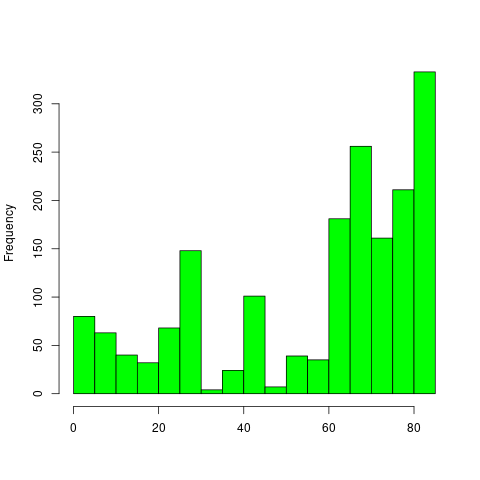

# test_compendium

The goal of **test_compendium** is to present a standard way to organise a computational research project.

## Example outputs

In this compendium, we have plotted the distribution of the number of coral genera for the world coral reefs:

|                             |
|:---------------------------:|
|  |
